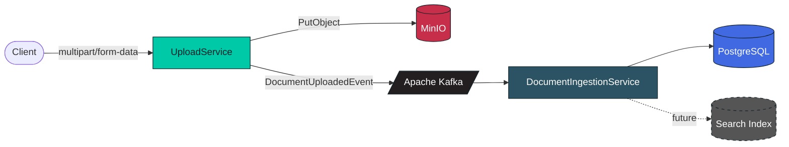

<div align="center">


<a href="https://github.com/Sanket9326/Distrubuted-Search-Engine">
  
</a>

<br/>


</div>

---

## Overview

**Distributed Search Engine** is a microservice-based system that will evolve into a hybrid **keyword + semantic** document search platform. Documents are uploaded through an HTTP API, streamed into object storage, announced on an event bus, and picked up asynchronously downstream for ingestion and (eventually) indexing.

<table align="center">
  <tr>
    <td align="center">📤<br/><b>Upload</b><br/><sub>ASP.NET Core API</sub></td>
    <td align="center">➡️</td>
    <td align="center">🪣<br/><b>Store</b><br/><sub>MinIO (S3-compatible)</sub></td>
    <td align="center">➡️</td>
    <td align="center">📣<br/><b>Publish</b><br/><sub>Apache Kafka</sub></td>
    <td align="center">➡️</td>
    <td align="center">⚙️<br/><b>Ingest</b><br/><sub>Worker Service</sub></td>
    <td align="center">➡️</td>
    <td align="center">🔎<br/><b>Search</b><br/><sub>Keyword + Semantic</sub></td>
  </tr>
</table>

## Table of Contents

- [Architecture](#architecture)
- [Solution Layout](#solution-layout)
- [Status](#status)
- [Getting Started](#getting-started)
- [Configuration](#configuration)
- [Verifying the Flow](#verifying-the-flow)
- [Coding Standards](#coding-standards)

## Architecture



## Solution Layout

```
src/
  BuildingBlocks/
    SharedKernel/     Base types shared across all services (BaseEntity, Result<T>, Error, exceptions)
    Contracts/        Cross-service DTOs and Kafka event contracts
    Infrastructure/   Shared infrastructure abstractions (Kafka, MinIO, file storage, clock)
    Common/           Cross-cutting extensions, middleware, logging, correlation ID support
  Services/
    UploadService/               ASP.NET Core Web API — upload → MinIO → Kafka
    DocumentIngestionService/    Worker service that consumes upload events and ingests documents
  Tests/
    UploadService.Tests/
    DocumentIngestionService.Tests/

docker-compose.yml   PostgreSQL, MinIO, Kafka, and service containers
```

## Status

| Component | State |
|---|---|
| ✅ Upload API (`UploadService`) | Implemented |
| ✅ MinIO object storage integration | Implemented |
| ✅ Kafka event publishing (`DocumentUploadedEvent`) | Implemented |
| 🚧 Document ingestion worker | Scaffolded, no logic yet |
| ⏳ PostgreSQL persistence layer | Not started |
| ⏳ Keyword search indexing | Not started |
| ⏳ Semantic search | Not started |

## Getting Started

**1. Configure environment**

```bash
cp .env.example .env
```

**2. Start local infrastructure** (PostgreSQL, MinIO, Kafka)

```bash
docker compose up -d postgres minio kafka
```

**3. Build & test**

```bash
dotnet build
dotnet test
```

**4. Run a service**

```bash
cd src/Services/UploadService
dotnet run
```

> Or bring the whole stack up in containers with `docker compose up -d`.

## Configuration

`UploadService` reads MinIO and Kafka settings from configuration (`appsettings.Development.json` locally, environment variables in Docker):

| Key | Purpose |
|---|---|
| `Kafka__BootstrapServers` | Kafka broker address |
| `Minio__Endpoint` | MinIO API endpoint |
| `Minio__AccessKey` / `Minio__SecretKey` | MinIO credentials |
| `Minio__BucketName` | Target bucket (auto-created if missing) |

## Verifying the Flow

```bash
# Upload a file
curl -F "file=@sample.pdf" http://localhost:5230/api/FileHandler/upload

# Watch the event land on the DocumentIngestion topic
docker exec -it document-search-kafka \
  /opt/kafka/bin/kafka-console-consumer.sh \
  --bootstrap-server localhost:9092 \
  --topic DocumentIngestion --from-beginning
```

## Coding Standards

- Target framework: **.NET 10**
- Nullable reference types and implicit usings enabled solution-wide
- Warnings are treated as errors (`Directory.Build.props`)
- File-scoped namespaces enforced via `.editorconfig`

---

<div align="center">

</div>
