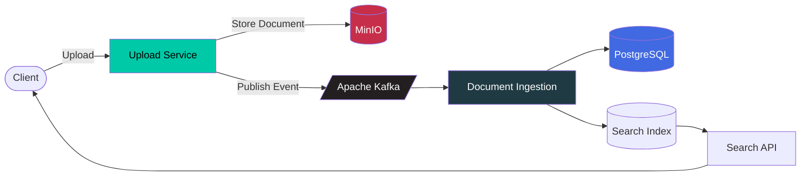

<div align="center">


<p>
<a href="https://github.com/Sanket9326">

</a>
</p>


</div>

---

# 🚀 Overview

**Distributed Search Engine** is a production-inspired search platform built with **.NET 10** using an **event-driven microservice architecture**.

The platform starts with document uploads and progressively evolves into a complete distributed search engine featuring:

- 🔍 Keyword Search
- 📖 Full-text Search
- ⚡ BM25 Ranking
- 📂 Distributed Indexing
- 🧠 Semantic Search
- 🤖 Vector Embeddings
- 🔄 Hybrid Retrieval
- 💬 Retrieval-Augmented Generation (RAG)

The objective is to build every major search engine component from scratch instead of relying on existing search platforms.

---

# ✨ Current Features

| Feature | Status |
|---------|:------:|
| 📤 Upload Documents | ✅ |
| 🪣 Store in MinIO | ✅ |
| 📣 Kafka Event Publishing | ✅ |
| ⚙️ Worker Service | 🚧 |
| 🗄 PostgreSQL Metadata | 🚧 |
| 🔍 Search API | ⏳ |
| 🧠 Semantic Search | ⏳ |

---

# 🏛 Architecture



---

# 🔄 Upload Flow

```text
          Upload File
                │
                ▼
      ASP.NET Core API
                │
                ▼
      Store File in MinIO
                │
                ▼
 Publish DocumentUploadedEvent
                │
                ▼
         Apache Kafka
                │
                ▼
 Document Ingestion Service
                │
                ▼
 Store Metadata (PostgreSQL)
                │
                ▼
     Future Search Index
```

---

# 🧠 Future Search Pipeline

```text
PDF / DOCX / TXT

        │

        ▼

 Text Extraction

        │

        ▼

 Tokenization

        │

        ▼

 Stop-word Removal

        │

        ▼

 Stemming

        │

        ▼

 Inverted Index

        │

        ▼

 BM25 Ranking

        │

        ▼

 Embedding Generation

        │

        ▼

 Vector Search

        │

        ▼

 Hybrid Ranking

        │

        ▼

 Search Results
```

---

# 🏗 Repository Structure

```text
src
│
├── BuildingBlocks
│   ├── SharedKernel
│   ├── Contracts
│   ├── Infrastructure
│   └── Common
│
├── Services
│   ├── UploadService
│   └── DocumentIngestionService
│
├── Tests
│   ├── UploadService.Tests
│   └── DocumentIngestionService.Tests
│
└── docker-compose.yml
```

---

# 🛠 Tech Stack

| Layer | Technology |
|--------|------------|
| Language | C# |
| Framework | .NET 10 |
| Messaging | Apache Kafka |
| Database | PostgreSQL |
| Object Storage | MinIO |
| Containerization | Docker |
| Architecture | Microservices |
| Communication | Event-Driven |
| Future Search | BM25 |
| Future AI | Vector Search + RAG |

---

# 🎯 Design Principles

- Clean Architecture
- Event-Driven Design
- SOLID Principles
- Dependency Injection
- Interface-Based Infrastructure
- Asynchronous Processing
- Loose Coupling
- High Cohesion
- Production-Inspired Engineering

---

# 🗺 Roadmap

## Phase 1 — Upload Platform

- [x] Upload API
- [x] MinIO Storage
- [x] Kafka Producer
- [x] Docker Infrastructure

## Phase 2 — Document Processing

- [ ] Kafka Consumer
- [ ] Metadata Storage
- [ ] Text Extraction
- [ ] Parsing Pipeline

## Phase 3 — Search Engine

- [ ] Tokenization
- [ ] Stop-word Removal
- [ ] Inverted Index
- [ ] Boolean Search
- [ ] Phrase Search
- [ ] Prefix Search

## Phase 4 — Ranking

- [ ] TF
- [ ] IDF
- [ ] TF-IDF
- [ ] BM25
- [ ] Top-K Retrieval

## Phase 5 — Distributed Search

- [ ] Sharding
- [ ] Replication
- [ ] Query Fan-out
- [ ] Distributed Index Updates

## Phase 6 — AI Search

- [ ] Embedding Generation
- [ ] Vector Store
- [ ] Semantic Search
- [ ] Hybrid Retrieval
- [ ] Re-ranking
- [ ] RAG

---

# 🚀 Getting Started

### Clone

```bash
git clone https://github.com/Sanket9326/Distributed-Search-Engine.git
```

### Configure

```bash
cp .env.example .env
```

### Start Infrastructure

```bash
docker compose up -d
```

### Build

```bash
dotnet build
```

### Test

```bash
dotnet test
```

### Run Upload Service

```bash
cd src/Services/UploadService

dotnet run
```

---

# 📈 Future Architecture

```text
                   Search API
                        │
                        ▼
              Hybrid Query Engine
              ┌─────────┴─────────┐
              ▼                   ▼
       Keyword Search      Semantic Search
              │                   │
      Inverted Index        Vector Database
              │                   │
              └─────────┬─────────┘
                        ▼
                   Re-ranking
                        │
                        ▼
                 Final Search Results
```

---

# 📖 Why this project?

Modern search systems are much more than simple databases.

This repository is an educational journey into how production-grade search engines are designed using distributed systems, asynchronous messaging, information retrieval algorithms, and AI-powered semantic search.

Rather than depending on existing search engines, the goal is to implement many core components from first principles to understand how modern search platforms work internally.

---

<div align="center">

### ⭐ If you like this project, consider giving it a Star!


</div>
