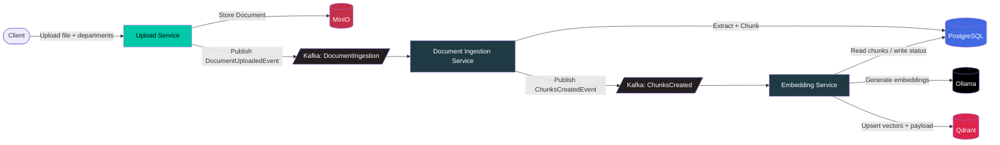

<div align="center">


<p>
<a href="https://github.com/Sanket9326">

</a>
</p>


</div>

---

# 🚀 Overview

**Distributed Search Engine** is a production-inspired search platform built with **.NET 10** using an **event-driven microservice architecture**.

The platform starts with document uploads and progressively evolves into a complete distributed search engine featuring:

- 🔍 Keyword Search
- 📖 Full-text Search
- ⚡ BM25 Ranking
- 📂 Distributed Indexing
- 🧠 Semantic Search
- 🤖 Vector Embeddings
- 🔄 Hybrid Retrieval
- 💬 Retrieval-Augmented Generation (RAG)

The objective is to build every major search engine component from scratch instead of relying on existing search platforms.

**Where things stand today:** a document can be uploaded, stored, chunked, embedded, and landed as a filterable vector in Qdrant, end to end. There is no query/search API yet — that's the next phase.

---

# ✨ Current Features

| Feature | Status |
|---------|:------:|
| 📤 Upload API (multipart, file + department authorization) | ✅ |
| 🪣 Store raw file in MinIO | ✅ |
| 📣 Kafka event publishing (`DocumentIngestion`, `ChunksCreated`) | ✅ |
| ⚙️ Document Ingestion worker (Kafka consumer) | ✅ |
| 🗄 PostgreSQL metadata + chunk storage | ✅ |
| 📄 Text extraction (PDF, DOCX, TXT) | ✅ |
| ✂️ Paragraph-aware chunking (with overlap) | ✅ |
| 🧬 Embedding generation (Ollama, `nomic-embed-text`, 768-dim) | ✅ |
| 🗂 Vector storage (Qdrant, one point per chunk) | ✅ |
| 🔐 Department-based authorization tagging on vectors | ✅ |
| 🔍 Search API | ⏳ |
| 🧠 Semantic Search (query → vector → results) | ⏳ |
| ⚡ BM25 / keyword search | ⏳ |
| 🔄 Hybrid retrieval + re-ranking + RAG | ⏳ |

---

# 🏛 Architecture



---

# 🔄 Current Data Flow

```text
              Upload File + Departments
                        │
                        ▼
              ASP.NET Core API (Upload Service)
                        │
                        ▼
              Store File in MinIO
                        │
                        ▼
        Publish DocumentUploadedEvent → Kafka
                        │
                        ▼
              Document Ingestion Service
                        │
          ┌─────────────┼─────────────┐
          ▼             ▼             ▼
   Validate Signature  Extract Text   Chunk Text
   (PDF/DOCX/TXT)      (per type)     (paragraph-aware,
                                       1200 chars, 150 overlap)
          │
          ▼
   Persist chunks + metadata → PostgreSQL
                        │
                        ▼
        Publish ChunksCreatedEvent → Kafka
                        │
                        ▼
              Embedding Service
                        │
          ┌─────────────┼─────────────┐
          ▼             ▼             ▼
   Read chunks       Generate        Read authorized
   from Postgres     embeddings      departments
                      (Ollama)
          │             │             │
          └─────────────┴─────────────┘
                        ▼
        Upsert vectors + payload → Qdrant
                        │
                        ▼
          Status: Embedded (or EmbeddingFailed)
                        │
                        ▼
              Future: Search API
```

---

# 🧩 Services at a Glance

| Service | Type | Port | Responsibility |
|---|---|---|---|
| **Upload Service** | ASP.NET Core Web API | `8080` | Validates + accepts uploads, stores the file in MinIO, publishes `DocumentUploadedEvent` |
| **Document Ingestion Service** | Background worker | — | Downloads the file, extracts text, chunks it, persists chunks/metadata to Postgres, publishes `ChunksCreatedEvent` |
| **Embedding Service** | Background worker | — | Reads chunks for a document, generates embeddings via Ollama, upserts vectors + payload into Qdrant, tracks status |

### Kafka topics

| Topic | Producer | Consumer | Payload |
|---|---|---|---|
| `DocumentIngestion` | Upload Service | Document Ingestion Service | `DocumentUploadedEvent` — `DocumentId`, `FileName`, `ContentType`, `AuthorizedDepartments`, `UploadedAtUtc` |
| `ChunksCreated` | Document Ingestion Service | Embedding Service | `ChunksCreatedEvent` — `DocumentId`, `ChunkCount`, `CreatedAtUtc` |

---

# 🗄 Data Model

### PostgreSQL — `document_metadata`

One row per uploaded document. Owned by Document Ingestion Service; Embedding Service reads/updates it too (shared database, no shared code between the two services).

| Column | Type | Notes |
|---|---|---|
| `document_id` | varchar(600) | **PK**, = MinIO object name |
| `file_name` | varchar(512) | |
| `content_type` | varchar(256) | |
| `authorized_departments` | int | `Department` flags enum |
| `uploaded_at_utc` | timestamp | |
| `ingested_at_utc` | timestamp | |
| `status` | int | `DocumentProcessingStatus` (see below) |
| `error_message` | varchar(2048) | nullable |

### PostgreSQL — `document_chunks`

One row per chunk. Unique on `(document_id, chunk_index)`, cascades on document delete.

| Column | Type | Notes |
|---|---|---|
| `id` | uuid | **PK**, also used as the Qdrant point id |
| `document_id` | varchar(600) | **FK** → `document_metadata` |
| `chunk_index` | int | 0-based order within the document |
| `content` | text | the chunk's text |
| `char_count` | int | |
| `created_at_utc` | timestamp | |

### Qdrant — collection `document_chunks`

768 dimensions, Cosine distance, one point per chunk (`id` = the chunk's Postgres `id`).

| Payload key | Type | Notes |
|---|---|---|
| `documentId` | string | |
| `chunkIndex` | int | |
| `content` | string | same text that was embedded |
| `createdAtUtc` | string | ISO-8601 |
| `authorizedDepartments` | string[] | flag names (e.g. `["Finance", "Engineering"]`), not the raw bitmask — enables a `MatchAny` filter against a caller's department once search exists |

### Document status lifecycle (`DocumentProcessingStatus`)

```text
0 Pending → 1 Processing → 2 Chunked → 3 Failed
                          → 4 Unsupported

2 Chunked → 5 Embedding → 6 Embedded
                         → 7 EmbeddingFailed
```

---

# 🏗 Repository Structure

```text
src
│
├── BuildingBlocks
│   ├── SharedKernel        # Kafka topic constants, cross-cutting constants
│   ├── Contracts           # Shared events (DocumentUploadedEvent, ChunksCreatedEvent)
│   │                       # and enums (DocumentProcessingStatus, Department)
│   ├── Infrastructure      # IKafkaProducer, IFileStorage, IMinioStorage abstractions
│   └── Common              # File validation, GUID generation utilities
│
├── Services
│   ├── UploadService              # Web API — upload endpoint
│   ├── DocumentIngestionService    # Worker — extract, chunk, persist
│   └── EmbeddingService            # Worker — embed, upsert to Qdrant
│
├── Tests
│   ├── UploadService.Tests
│   ├── DocumentIngestionService.Tests
│   └── EmbeddingService.Tests
│
└── docker-compose.yml
```

---

# 🛠 Tech Stack

| Layer | Technology |
|--------|------------|
| Language | C# |
| Framework | .NET 10 |
| Messaging | Apache Kafka |
| Database | PostgreSQL |
| Object Storage | MinIO |
| Embedding Model Runtime | Ollama (`nomic-embed-text`, 768-dim) |
| Vector Store | Qdrant (Cosine similarity) |
| Containerization | Docker / Docker Compose |
| Architecture | Microservices, event-driven |
| Future Search | BM25, hybrid retrieval, RAG |

---

# 🎯 Design Principles

- Clean Architecture
- Event-Driven Design
- SOLID Principles
- Dependency Injection
- Interface-Based Infrastructure
- Asynchronous Processing
- Loose Coupling
- High Cohesion
- Production-Inspired Engineering

---

# 🗺 Roadmap

## Phase 1 — Upload Platform

- [x] Upload API
- [x] MinIO Storage
- [x] Kafka Producer
- [x] Docker Infrastructure

## Phase 2 — Document Processing

- [x] Kafka Consumer
- [x] Metadata Storage
- [x] Text Extraction
- [x] Parsing Pipeline (chunking)

## Phase 3 — Search Engine

- [ ] Tokenization
- [ ] Stop-word Removal
- [ ] Inverted Index
- [ ] Boolean Search
- [ ] Phrase Search
- [ ] Prefix Search

## Phase 4 — Ranking

- [ ] TF
- [ ] IDF
- [ ] TF-IDF
- [ ] BM25
- [ ] Top-K Retrieval

## Phase 5 — Distributed Search

- [ ] Sharding
- [ ] Replication
- [ ] Query Fan-out
- [ ] Distributed Index Updates

## Phase 6 — AI Search

- [x] Embedding Generation
- [x] Vector Store
- [ ] Semantic Search (query API)
- [ ] Hybrid Retrieval
- [ ] Re-ranking
- [ ] RAG

---

# 🚀 Getting Started

### Clone

```bash
git clone https://github.com/Sanket9326/Distributed-Search-Engine.git
```

### Configure

```bash
cp .env.example .env
```

### Start Infrastructure + Services

```bash
docker compose up -d --build
```

This brings up Postgres, pgAdmin, MinIO, Kafka, Qdrant, Ollama, and all three .NET services (Upload, Document Ingestion, Embedding). On first run, Ollama pulls the `nomic-embed-text` model — the Embedding Service waits for that before it starts consuming.

### Build & Test locally

```bash
dotnet build
dotnet test
```

### Try it

```
POST http://localhost:8080/api/FileHandler/upload
Content-Type: multipart/form-data

file: <your .pdf / .docx / .txt>
departments: Finance,Engineering   # optional, comma-separated
```

Check progress:
- **Postgres** (`document_metadata.status`) — via pgAdmin at `http://localhost:5050`
- **Qdrant** — built-in dashboard at `http://localhost:6333/dashboard`

---

# 📈 Future Architecture

```text
                   Search API
                        │
                        ▼
              Hybrid Query Engine
              ┌─────────┴─────────┐
              ▼                   ▼
       Keyword Search      Semantic Search
              │                   │
      Inverted Index        Qdrant Vector Store
              │                   │
              └─────────┬─────────┘
                        ▼
                   Re-ranking
                        │
                        ▼
                 Final Search Results
```

---

# 📖 Why this project?

Modern search systems are much more than simple databases.

This repository is an educational journey into how production-grade search engines are designed using distributed systems, asynchronous messaging, information retrieval algorithms, and AI-powered semantic search.

Rather than depending on existing search engines, the goal is to implement many core components from first principles to understand how modern search platforms work internally.

---

<div align="center">

### ⭐ If you like this project, consider giving it a Star!


</div>
