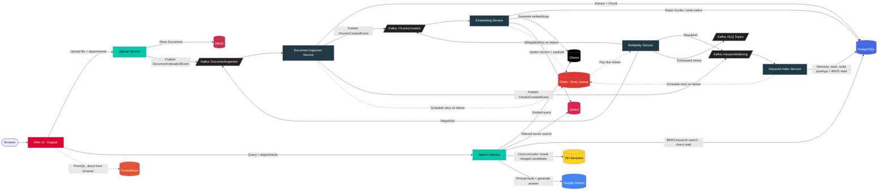

<div align="center">


<p>
<a href="https://github.com/Sanket9326">

</a>
</p>


</div>

---

# 🚀 Overview

**Distributed Search Engine** is a production-inspired search platform built with **.NET 10** using an **event-driven microservice architecture**.

The platform starts with document uploads and progressively evolves into a complete distributed search engine featuring:

- 🔍 Keyword Search
- 📖 Full-text Search
- ⚡ BM25 Ranking
- 📂 Distributed Indexing
- 🧠 Semantic Search
- 🤖 Vector Embeddings
- 🔄 Hybrid Retrieval
- 💬 Retrieval-Augmented Generation (RAG)

The objective is to build every major search engine component from scratch instead of relying on existing search platforms.

**Where things stand today:** the full pipeline is end to end — a document can be uploaded, stored, and chunked, then **two independent pipelines run off the same chunks in parallel**: one embeds them into Qdrant for semantic search, the other tokenizes/stems them into a hand-built inverted index in PostgreSQL (with BM25 statistics) for keyword search. A query fans out to **both** retrieval paths at once — a department-filtered Qdrant vector search and a BM25 lexical search — and the results are merged (deduplicated by chunk) and pushed through a single cross-encoder re-ranker, so the same relevance model scores candidates from either source on one scale. That's real **hybrid retrieval**, not just semantic search. On top of that, a **RAG answer endpoint** takes those re-ranked chunks, builds a token-budgeted prompt, and calls Google Gemini to return a grounded, cited natural-language answer, rendered as **Markdown** in the UI. An **Angular Web UI** sits in front of both (upload + a chat-style ask page + a live metrics dashboard), so the whole thing is usable from a browser, not just `curl`. Failures in the ingestion/embedding/indexing pipelines are no longer terminal — a Redis-backed **retry queue** with exponential backoff and a dedicated **Reliability Service** now automatically re-attempts failed messages and routes exhausted ones to a Kafka dead-letter topic.

---

# ✨ Current Features

| Feature | Status |
|---------|:------:|
| 📤 Upload API (multipart, file + department authorization) | ✅ |
| 🪣 Store raw file in MinIO | ✅ |
| 📣 Kafka event publishing (`DocumentIngestion`, `ChunksCreated`, `KeywordIndexing`) | ✅ |
| ⚙️ Document Ingestion worker (Kafka consumer) | ✅ |
| 🗄 PostgreSQL metadata + chunk storage | ✅ |
| 📄 Text extraction (PDF, DOCX, TXT) | ✅ |
| ✂️ Paragraph-aware chunking (with overlap) | ✅ |
| 🧬 Embedding generation (Ollama, `nomic-embed-text`, 768-dim) | ✅ |
| 🗂 Vector storage (Qdrant, one point per chunk) | ✅ |
| 🔐 Department-based authorization tagging on vectors | ✅ |
| 🔍 Search API (`POST /api/search`) | ✅ |
| 🧠 Semantic Search (query → embed → Qdrant → results) | ✅ |
| ✂️ Tokenization + stop-word removal + Porter2 stemming | ✅ |
| 📂 Custom inverted index (PostgreSQL, `index_terms`/`index_postings`) | ✅ |
| ⚡ BM25 keyword search (with corpus-wide stats for length normalization) | ✅ |
| 🔐 Department-based authorization tagging on the keyword index too | ✅ |
| 🔄 Hybrid retrieval (parallel vector + keyword search, merged by chunk) | ✅ |
| 🎯 Cross-encoder re-ranking of the merged candidate set (TEI, `bge-reranker-v2-m3`) | ✅ |
| 🔐 Department-filtered retrieval on both search paths | ✅ |
| 🧩 Token-budgeted prompt builder over re-ranked chunks | ✅ |
| 💬 RAG Answer API (`POST /api/search/answer`, Google Gemini) | ✅ |
| 📈 Prometheus metrics (`/metrics`) on every .NET service | ✅ |
| 🩺 Dependency-aware health checks (`/health`, `/health/live`) | ✅ |
| 🐳 Per-container CPU/memory/network metrics (cAdvisor) | ✅ |
| 📊 Grafana dashboards (auto-provisioned) | ✅ |
| 📝 Structured JSON logging (Serilog) | ✅ |
| 🖥 Angular Web UI (upload, RAG chat, live metrics) | ✅ |
| 📑 Markdown-rendered RAG answers in the UI | ✅ |
| 🔁 Redis-backed retry queue with exponential backoff | ✅ |
| ☠️ Dead-letter queue (DLQ) for exhausted retries | ✅ |
| 🛡 Dedicated Reliability Service (retry/DLQ worker) | ✅ |
| 📖 Phrase / proximity search (positions are tracked, not yet queried) | ⏳ |

---

# 🏛 Architecture


```mermaid
flowchart LR

Client([Browser])

WebUI[Web UI - Angular]

API[Upload Service]

MinIO[(MinIO)]

Kafka1[/Kafka: DocumentIngestion/]

Worker[Document Ingestion Service]

Postgres[(PostgreSQL)]

Kafka2[/Kafka: ChunksCreated/]

Kafka3[/Kafka: KeywordIndexing/]

Embed[Embedding Service]

KeywordIndex[Keyword Index Service]

Ollama[(Ollama)]

Qdrant[(Qdrant)]

Search[Search Service]

Reranker[(TEI Reranker)]

Gemini[(Google Gemini)]

Redis[(Redis - Retry Queue)]

Reliability[Reliability Service]

DLQ[/Kafka: DLQ Topics/]

Client --> WebUI

WebUI -->|Upload file + departments| API

API -->|Store Document| MinIO

API -->|Publish DocumentUploadedEvent| Kafka1

Kafka1 --> Worker

Worker -->|Extract + Chunk| Postgres

Worker -->|Publish ChunksCreatedEvent| Kafka2

Worker -->|Publish ChunksCreatedEvent| Kafka3

Kafka2 --> Embed

Kafka3 --> KeywordIndex

Embed -->|Read chunks / write status| Postgres

Embed -->|Generate embeddings| Ollama

Embed -->|Upsert vectors + payload| Qdrant

KeywordIndex -->|Tokenize, stem, build postings + BM25 stats| Postgres

Search -->|Embed query| Ollama

Search -->|Filtered vector search| Qdrant

Search -->|BM25 keyword search - direct read| Postgres

WebUI -->|Query + departments| Search

WebUI -.->|PromQL, direct from browser| Prometheus[(Prometheus)]

Search -->|Cross-encoder rerank merged candidates| Reranker

Search -->|Prompt-build + generate answer| Gemini

Worker -.->|Schedule retry on failure| Redis

Embed -.->|Schedule retry on failure| Redis

KeywordIndex -.->|Schedule retry on failure| Redis

Redis -.->|Pop due retries| Reliability

Reliability -->|Republish| Kafka1

Reliability -->|Republish| Kafka2

Reliability -->|Republish| Kafka3

Reliability -->|Exhausted retries| DLQ

style API fill:#00c9a7,color:#000
style Search fill:#00c9a7,color:#000
style WebUI fill:#DD0031,color:#fff
style Worker fill:#203A43,color:#fff
style Embed fill:#203A43,color:#fff
style KeywordIndex fill:#203A43,color:#fff
style Kafka1 fill:#231F20,color:#fff
style Kafka2 fill:#231F20,color:#fff
style Kafka3 fill:#231F20,color:#fff
style MinIO fill:#C72E49,color:#fff
style Postgres fill:#4169E1,color:#fff
style Qdrant fill:#DC244C,color:#fff
style Ollama fill:#000000,color:#fff
style Reranker fill:#FFD21E,color:#000
style Gemini fill:#4285F4,color:#fff
style Prometheus fill:#E6522C,color:#fff
style Redis fill:#DC382D,color:#fff
style Reliability fill:#203A43,color:#fff
style DLQ fill:#231F20,color:#fff
```

> 🔁 **Reliability at a glance:** when the Document Ingestion, Embedding, or Keyword Index Service fails to process a message (Ollama timeout, DB blip, etc.), it schedules a retry in Redis instead of dropping it. The **Reliability Service** wakes up when a retry becomes due, republishes it to its original Kafka topic with retry-count headers, and — once a message exceeds the configured max retry count — routes it to that topic's dead-letter topic instead. See [Reliability & Retries](#-reliability--retries) below.

---

# 🔄 Current Data Flow

```text
              Upload File + Departments
                        │
                        ▼
              ASP.NET Core API (Upload Service)
                        │
                        ▼
              Store File in MinIO
                        │
                        ▼
        Publish DocumentUploadedEvent → Kafka
                        │
                        ▼
              Document Ingestion Service
                        │
          ┌─────────────┼─────────────┐
          ▼             ▼             ▼
   Validate Signature  Extract Text   Chunk Text
   (PDF/DOCX/TXT)      (per type)     (paragraph-aware,
                                       1200 chars, 150 overlap)
          │
          ▼
   Persist chunks + metadata → PostgreSQL
                        │
                        ▼
        Publish ChunksCreatedEvent → Kafka
          (to BOTH "ChunksCreated" and
           "KeywordIndexing" topics)
                        │
          ┌─────────────┴─────────────┐
          ▼                           ▼
   Embedding Service           Keyword Index Service
          │                           │
   ┌──────┼──────┐             ┌──────┼──────────────┐
   ▼      ▼      ▼             ▼      ▼              ▼
Read    Generate  Read      Read    Tokenize →     Denormalize
chunks  embeddings authorized chunks  lowercase →    FileName +
from    (Ollama)  departments from    stop-word      AuthorizedDepts
Postgres                     Postgres  filter →       → index_document_
   │      │         │           │     Porter2 stem      metadata
   └──────┴─────────┘           │        │                  │
          ▼                     └────────┴──────────────────┘
Upsert vectors + payload                 ▼
      → Qdrant                 Build inverted index:
          │                    index_terms / index_postings
          ▼                    + BM25 stats: index_chunk_stats /
Status: Embedded                index_stats (corpus totals)
(or EmbeddingFailed)                     │
                                          ▼
                              Status: Indexed (or IndexingFailed)

   (On failure anywhere above: schedule retry in Redis
    with backoff → Status: PendingRetry. Reliability
    Service pops due retries → republishes to the
    original Kafka topic, or — once max retries are
    exceeded — routes to that topic's DLQ.)


              Query + Departments
                        │
                        ▼
              Search Service
                        │
          ┌─────────────┼─────────────┐
          ▼             ▼             ▼
   Sanitize query   Parse/validate  Embed query
                     departments     (Ollama)
          │             │             │
          └─────────────┴─────────────┘
                        ▼
          ┌─────────────┴─────────────┐            (run in parallel,
          ▼                           ▼             Task.WhenAll)
Filtered vector search        BM25 keyword search
(Qdrant, by department)       (Postgres, by department -
          │                    tokenize query with the same
          │                    analyzer used at index time)
          └─────────────┬─────────────┘
                         ▼
        Merge candidates, de-duplicated by ChunkId
                         ▼
      Cross-encoder rerank the merged set (TEI, bge-reranker-v2-m3)
      — one relevance model scores both sources on one scale
                         ▼
                 Top-K Search Results
                        │
                        │   (POST /api/search/answer only)
                        ▼
         Prompt Builder (token-budgeted context packing)
                        ▼
         Generate answer (Google Gemini)
                        ▼
         Answer + cited Sources
```

---

# 🧩 Services at a Glance

| Service | Type | Port | Responsibility |
|---|---|---|---|
| **Upload Service** | ASP.NET Core Web API | `8080` | Validates + accepts uploads, stores the file in MinIO, publishes `DocumentUploadedEvent` |
| **Document Ingestion Service** | Background worker + minimal HTTP (`/health`, `/metrics`) | `8083` | Downloads the file, extracts text, chunks it, persists chunks/metadata to Postgres, publishes `ChunksCreatedEvent` |
| **Embedding Service** | Background worker + minimal HTTP (`/health`, `/metrics`) | `8084` | Reads chunks for a document, generates embeddings via Ollama, upserts vectors + payload into Qdrant, tracks status |
| **Keyword Index Service** | Background worker + minimal HTTP (`/health`, `/metrics`) | `8087` | Reads chunks for a document, tokenizes/stems them (stop-words removed), builds the inverted index (`index_terms`/`index_postings`) plus BM25 length-normalization stats (`index_chunk_stats`/`index_stats`) and the authorization/display row (`index_document_metadata`) in Postgres, tracks status. Query-side only — no search endpoint of its own; Search Service reads these tables directly |
| **Search Service** | ASP.NET Core Web API | `8081` | Embeds the query (Ollama) and runs a department-filtered vector search against Qdrant, **in parallel** with a BM25 keyword search read directly against the Keyword Index Service's Postgres tables; merges both candidate sets (deduplicated by chunk), re-ranks the union via a TEI cross-encoder, returns top-K hybrid results (`POST /api/search`); optionally builds a token-budgeted prompt from those chunks and generates a grounded, cited answer via Google Gemini (`POST /api/search/answer`) |
| **Reliability Service** | Background worker + minimal HTTP (`/health`, `/metrics`) | `8086` | Ensures DLQ topics exist on startup, drains the shared Redis retry queue as entries become due, republishes them to their original Kafka topic (with retry-tracking headers), or routes exhausted messages to that topic's dead-letter topic |
| **Web UI** | Angular SPA (nginx-served) | `4200` | Browser client: upload page, RAG chat ("Ask") page, live metrics dashboard |

### External inference dependencies

| Component | Role | Port |
|---|---|---|
| **Ollama** (`nomic-embed-text`) | Embeds document chunks (Embedding Service) and queries (Search Service) into 768-dim vectors | `11434` |
| **TEI Reranker** (`BAAI/bge-reranker-v2-m3`) | Cross-encoder re-scores Qdrant's top candidates against the raw query for true relevance | `8082` |
| **Google Gemini** (`gemini-flash-lite-latest`) | Generates a cited natural-language answer from the re-ranked chunks (`POST /api/search/answer` only) | — (hosted API) |

> ⚠️ First boot note: the TEI reranker container downloads the model on first start. `bge-reranker-v2-m3` has no published ONNX weights, so TEI falls back to safetensors + CPU (Candle backend) — first-time download + warmup can take **10–15 minutes**. `search-service` calls will `500` with `Connection refused (reranker:80)` until `GET http://localhost:8082/health` returns `200`.

### Kafka topics

| Topic | Producer | Consumer | Payload |
|---|---|---|---|
| `DocumentIngestion` | Upload Service, Reliability Service (republish) | Document Ingestion Service | `DocumentUploadedEvent` — `DocumentId`, `FileName`, `ContentType`, `AuthorizedDepartments`, `UploadedAtUtc` |
| `ChunksCreated` | Document Ingestion Service, Reliability Service (republish) | Embedding Service | `ChunksCreatedEvent` — `DocumentId`, `FileName`, `AuthorizedDepartments`, `ChunkCount`, `CreatedAtUtc` |
| `KeywordIndexing` | Document Ingestion Service, Reliability Service (republish) | Keyword Index Service | `ChunksCreatedEvent` — same payload/event type as `ChunksCreated`, published a second time so embedding and keyword indexing run as fully independent, parallel Kafka consumers off the same chunking pass |
| `DocumentIngestion.DLQ` | Reliability Service | *(none yet — inspect via consumer tooling)* | Same payload as `DocumentIngestion`, plus `x-retry-count`/`x-first-failed-at-utc`/`x-last-failed-at-utc` headers |
| `ChunksCreated.DLQ` | Reliability Service | *(none yet — inspect via consumer tooling)* | Same payload as `ChunksCreated`, plus the same retry headers |
| `KeywordIndexing.DLQ` | Reliability Service | *(none yet — inspect via consumer tooling)* | Same payload as `KeywordIndexing`, plus the same retry headers |

Retry-tracking headers (`x-retry-count`, `x-first-failed-at-utc`, `x-last-failed-at-utc`) are only present on messages the Reliability Service has republished at least once; a message's first attempt carries none of them.

---

# 🛡 Reliability & Retries

Document Ingestion, Embedding, and Keyword Index each depend on things that can transiently fail — Postgres blips, MinIO hiccups, a slow/unavailable Ollama. Instead of dropping a message on failure, all three services catch the exception and hand it to a shared **`IRetryQueue`** (`src/BuildingBlocks/Infrastructure/IRetryQueue.cs`), backed by **Redis** (`RedisRetryQueue`, `src/BuildingBlocks/Common/Reliability/`).

**How scheduling works:** a failed message is JSON-serialized into a `RetryEnvelope` (original topic, key, payload, retry count, first/last failure time, last error) and added to a single Redis sorted set (`retry:queue`), scored by the Unix-ms timestamp it becomes due. The due delay follows a configurable backoff schedule — by default `2, 5, 15, 30, 60` minutes for retry attempts 1–5, clamped to the last entry beyond that. The document/chunk's status flips to `PendingRetry` in Postgres while it waits.

**How draining works:** the standalone **Reliability Service** (`src/Services/ReliabilityService/`) runs a single background loop (`RetryQueuePollingHostedService`) that:
1. Peeks the next due timestamp instead of polling the whole queue, sleeping until then (capped at `MaxWaitSeconds`, so a newly-scheduled earlier item is never missed for long).
2. Atomically pops up to `PopBatchSize` due envelopes via a Lua script (`ZRANGEBYSCORE` + `ZREM` in one round-trip) — safe even with multiple replicas, since Redis executes it single-threaded.
3. For each envelope: if it's still within `MaxRetryCount`, republishes it to its original Kafka topic with `x-retry-count`/`x-first-failed-at-utc`/`x-last-failed-at-utc` headers so the consumer knows this isn't a first attempt; once exhausted, routes it to that topic's dead-letter topic instead (`DocumentIngestion.DLQ` / `ChunksCreated.DLQ`, auto-created on startup by `DlqTopicInitializer` if missing).

A message that fails to publish during routing (e.g. broker unreachable) is re-scheduled rather than lost — the one gap being a worker crash in the narrow window between the atomic pop and a successful publish.

Retry-aware metrics (see [Observability](#-observability) below): `retry_scheduled_total{topic}`, `retry_republished_total{topic}`, `retry_exhausted_total{topic}`, and a `retry_queue_depth` gauge — all visible on the Web UI's **Metrics** page and the Grafana dashboard.

Configuration (`Retry` section, `RetrySettings`):

| Setting | Default | Meaning |
|---|---|---|
| `MaxRetryCount` | `5` | Attempts beyond this are routed to the DLQ instead of retried again |
| `BackoffMinutes` | `[2, 5, 15, 30, 60]` | Delay for the Nth retry, indexed by `retryCount - 1`, clamped to the last entry |
| `IdlePollSeconds` | `5` | How often the worker re-checks Redis when the queue is empty |
| `MaxWaitSeconds` | `30` | Upper bound on how long the worker sleeps waiting for the next due item |
| `PopBatchSize` | `50` | Max envelopes popped per due batch |

---

# 📊 Observability

Every .NET service exposes the same three endpoints (via a shared `Common.Extensions` wiring, `src/BuildingBlocks/Common/Extensions/`):

| Endpoint | Purpose |
|---|---|
| `GET /metrics` | Prometheus exposition format — generic HTTP request rate/latency (`prometheus-net`) plus one domain-specific counter per service (`documents_uploaded_total`, `documents_ingested_total`, `chunks_embedded_total`, `chunks_keyword_indexed_total`, `rag_answers_generated_total`) and, for the retry path, `retry_scheduled_total{topic}` / `retry_republished_total{topic}` / `retry_exhausted_total{topic}` / `retry_queue_depth` |
| `GET /health` | Real dependency checks (Postgres, Kafka, Qdrant, MinIO, Ollama, TEI reranker, Redis; Gemini is a config-presence check only — see note below) as readable JSON, e.g. `{ "status": "Healthy", "checks": [...] }`. Search Service's Postgres check covers the read-only connection it now uses for BM25 keyword search |
| `GET /health/live` | Liveness only — always `200` if the process is up, no dependency calls |

Health results are also republished as a `health_check_status` Prometheus gauge (1 = healthy, 0.5 = degraded, 0 = unhealthy) every 15s, so health shows up in Grafana from the same datasource as everything else — no separate JSON-API datasource needed.

> ⚠️ Gemini's health check never makes a live API call — it only checks that `GEMINI_API_KEY` is configured. Free-tier Gemini quotas are tight enough that a live call on every 15s health poll would compete with actual answer generation for the same budget.

### Stack

| Component | Role | Port |
|---|---|---|
| **Prometheus** | Scrapes `/metrics` from all 6 .NET services + cAdvisor every 15s | `9090` |
| **Grafana** | Auto-provisioned Prometheus datasource + a "System Overview" dashboard (per-service health, request rate/latency, domain counters, per-container CPU/memory/network) | `3000` (default login `admin` / `GRAFANA_ADMIN_PASSWORD`) |
| **cAdvisor** | Reports CPU/memory/network for every container in the stack (not just the .NET services) | `8085` |

Config lives in `observability/prometheus/prometheus.yml` and `observability/grafana/provisioning/`. Structured logging (Serilog, JSON to console) is wired into every service but isn't shipped anywhere yet — check logs via `docker compose logs <service>`; log aggregation (e.g. Loki) is a deliberately deferred follow-up.

> ⚠️ **cAdvisor on Docker Desktop (Windows/Mac)**: cAdvisor's per-container CPU/memory/network breakdown relies on inspecting each container's overlay filesystem layer directly, which only works reliably on a native Linux Docker host. On Docker Desktop for Windows/Mac (containers running inside an internal VM), cAdvisor can't resolve individual container layers and only reports Docker Desktop's own internal cgroup slices (`/docker`, `/kubepods`, ...) instead of per-service names — the "Container Resources" dashboard row will be empty/unhelpful there. Everything else (health, metrics, dashboards, per-service panels) is unaffected and works identically on any platform.

---

# 🖥 Web UI

An Angular SPA (`src/Services/WebUI`) at `http://localhost:4200`, containerized and served via nginx — three pages:

| Page | Route | Calls | Description |
|---|---|---|---|
| **Upload** | `/upload` | `POST http://localhost:8080/api/FileHandler/upload` | Drag-and-drop file zone + multi-select department picker |
| **Ask** | `/ask` | `POST http://localhost:8081/api/search/answer` | Chat-style RAG Q&A; pick "your department" (single-select stand-in until real auth exists); the answer is rendered as **Markdown** (via `marked`) rather than raw text, and while waiting for a response a rotating set of loading phrases ("Thinking…", "Reading through your documents…", ...) cycles every 1.8s instead of a static spinner label |
| **Metrics** | `/metrics` | Prometheus HTTP API directly (`http://localhost:9090`) | Fully custom dashboard (not a Grafana embed) — service health tiles (including Reliability and Keyword Index Service), domain counters, request rate/latency, a retry queue depth chart, per-container resources — polling every 15s |

**Stack:** Angular 19 (standalone components, signals), Angular Material + Tailwind CSS for styling, `ngx-echarts`/Apache ECharts for the metrics charts, `marked` for Markdown rendering.

The browser always talks to the host-mapped ports (`localhost:8080`/`:8081`/`:9090`), never the internal docker-network hostnames — configured once in `src/environments/environment.ts`. This is also the first browser client in the repo, so CORS is enabled specifically for the UI's origin on `UploadService`, `SearchService` (`Cors:WebUiOrigin` config, defaults to `http://localhost:4200`), and Prometheus (`--web.cors.origin` flag in `docker-compose.yml`).

> Note: there's no authentication anywhere in this repo yet. The Ask page's department picker is a manual stand-in for "the logged-in user's department" — a placeholder until real auth is added, not a security boundary.

---

# 🗄 Data Model

### PostgreSQL — `document_metadata`

One row per uploaded document. Owned by Document Ingestion Service; Embedding Service reads/updates it too (shared database, no shared code between the two services).

| Column | Type | Notes |
|---|---|---|
| `document_id` | varchar(600) | **PK**, = MinIO object name |
| `file_name` | varchar(512) | |
| `content_type` | varchar(256) | |
| `authorized_departments` | int | `Department` flags enum |
| `uploaded_at_utc` | timestamp | |
| `ingested_at_utc` | timestamp | |
| `status` | int | `DocumentProcessingStatus` (see below) |
| `error_message` | varchar(2048) | nullable |

### PostgreSQL — `document_chunks`

One row per chunk. Unique on `(document_id, chunk_index)`, cascades on document delete. Owned by Document Ingestion Service; read-only by Keyword Index Service (to tokenize) and by Search Service (to hydrate BM25 candidates with their chunk content) — same "shared database, no shared code" convention as `document_metadata`.

| Column | Type | Notes |
|---|---|---|
| `id` | uuid | **PK**, also used as the Qdrant point id |
| `document_id` | varchar(600) | **FK** → `document_metadata` |
| `chunk_index` | int | 0-based order within the document |
| `content` | text | the chunk's text |
| `char_count` | int | |
| `created_at_utc` | timestamp | |

### Qdrant — collection `document_chunks`

768 dimensions, Cosine distance, one point per chunk (`id` = the chunk's Postgres `id`).

| Payload key | Type | Notes |
|---|---|---|
| `documentId` | string | |
| `fileName` | string | |
| `chunkIndex` | int | |
| `content` | string | same text that was embedded |
| `createdAtUtc` | string | ISO-8601 |
| `authorizedDepartments` | string[] | flag names (e.g. `["Finance", "Engineering"]`), not the raw bitmask — enables a `MatchAny` filter against a caller's department at search time |

### PostgreSQL — keyword index tables (owned by Keyword Index Service)

A hand-built inverted index plus the BM25 statistics needed to score it, kept in the same Postgres instance as everything else. Populated by the Keyword Index Service; read directly (read-only) by the Search Service at query time — no HTTP hop between them.

**`index_terms`** — one row per distinct stemmed term across the whole corpus:

| Column | Type | Notes |
|---|---|---|
| `TermId` | int | **PK**, identity |
| `Term` | varchar(100) | unique |
| `DocumentFrequency` | int | number of distinct chunks currently containing this term — the BM25 `df` |

**`index_postings`** — one row per (term, chunk) pair:

| Column | Type | Notes |
|---|---|---|
| `TermId` | int | **PK part**, FK → `index_terms` (cascade delete) |
| `ChunkId` | uuid | **PK part**, indexed |
| `DocumentId` | varchar(600) | denormalized from the chunk, indexed |
| `TermFrequency` | int | raw occurrence count of the term within this chunk — the BM25 `tf` |
| `Positions` | int[] | 0-based word offsets, assigned before stop-word removal — tracked for future phrase/proximity search, not yet queried |

**`index_chunk_stats`** — one row per chunk, the BM25 length-normalization input:

| Column | Type | Notes |
|---|---|---|
| `ChunkId` | uuid | **PK** |
| `DocumentId` | varchar(600) | indexed |
| `TokenCount` | int | post-stop-word-filter token count for this chunk |

**`index_stats`** — a single singleton row (`Id = 1`) holding corpus-wide BM25 totals, maintained incrementally alongside postings/chunk-stats so query time never needs a full-table aggregate:

| Column | Type | Notes |
|---|---|---|
| `Id` | int | **PK**, always `1` |
| `TotalChunks` | bigint | corpus-wide chunk count — BM25's `N` |
| `TotalTokenLength` | bigint | corpus-wide token count — `avgdl = TotalTokenLength / TotalChunks` |

**`index_document_metadata`** — one row per document, the keyword-side equivalent of Qdrant's per-point `authorizedDepartments`/`fileName` payload fields, since the keyword tables above have no authorization data of their own:

| Column | Type | Notes |
|---|---|---|
| `DocumentId` | varchar(600) | **PK** |
| `AuthorizedDepartments` | int | `Department` flags enum bitmask |
| `FileName` | varchar(600) | |
| `UpdatedAtUtc` | timestamp | |

**`keyword_index_status`** — per-document indexing status, mirrors `document_metadata`'s role for the ingestion pipeline:

| Column | Type | Notes |
|---|---|---|
| `DocumentId` | varchar(600) | **PK** |
| `Status` | int | `KeywordIndexStatus`: `Pending, Indexing, Indexed, IndexingFailed, PendingRetry` |
| `ErrorMessage` | varchar(2048) | nullable |
| `IndexedAtUtc` | timestamp | nullable |
| `UpdatedAtUtc` | timestamp | |

### Document status lifecycle (`DocumentProcessingStatus`)

```text
0 Pending → 1 Processing → 2 Chunked → 3 Failed
                          → 4 Unsupported
                          → 8 PendingRetry → (retried) → 2 Chunked / 3 Failed

2 Chunked → 5 Embedding → 6 Embedded
                         → 7 EmbeddingFailed
                         → 8 PendingRetry → (retried) → 6 Embedded / 7 EmbeddingFailed
```

`8 PendingRetry` is set whenever a failure is successfully scheduled onto the Redis retry queue ([Reliability & Retries](#-reliability--retries)); it only settles into a terminal `Failed`/`EmbeddingFailed` once the message has exhausted `MaxRetryCount` attempts.

### Keyword index status lifecycle (`KeywordIndexStatus`)

```text
Pending → Indexing → Indexed
                    → IndexingFailed
                    → PendingRetry → (retried) → Indexed / IndexingFailed
```

Tracked per document in `keyword_index_status`, independently of `document_metadata.status` — the two pipelines (embedding, keyword indexing) run off the same `ChunksCreatedEvent` but can succeed/fail/retry on entirely separate schedules.

---

# 🏗 Repository Structure

```text
src
│
├── BuildingBlocks
│   ├── SharedKernel        # Kafka topic/DLQ constants, retry header names, cross-cutting constants
│   ├── Contracts           # Shared events (DocumentUploadedEvent, ChunksCreatedEvent - now carries
│   │                       # FileName + AuthorizedDepartments too), enums (DocumentProcessingStatus,
│   │                       # Department), and Reliability/ (RetryContext, RetryEnvelope)
│   ├── Infrastructure      # IKafkaProducer, IFileStorage, IMinioStorage, IEmbeddingGenerator, IRetryQueue
│   └── Common              # File validation, GUID generation, department parsing, text sanitization,
│                           # shared observability wiring (Extensions/) — Prometheus health-check
│                           # publisher, /health JSON writer, used identically by all 6 services,
│                           # plus Reliability/ (RedisRetryQueue, RetrySettings, RedisSettings)
│
├── observability
│   ├── prometheus          # prometheus.yml scrape config
│   └── grafana/provisioning  # datasource + auto-provisioned dashboard
│
├── Services
│   ├── UploadService              # Web API — upload endpoint
│   ├── DocumentIngestionService    # Worker — extract, chunk, persist, fan out ChunksCreatedEvent
│   │                                # to BOTH the embedding and keyword-indexing topics
│   ├── EmbeddingService            # Worker — embed, upsert to Qdrant
│   ├── KeywordIndexService          # Worker — tokenize/stem chunks (Services/Indexing/), build the
│   │                                 # inverted index + BM25 stats + authorization metadata in Postgres
│   ├── SearchService                # Web API — embed query + BM25-tokenize query, run vector search
│   │                                # (Qdrant) and keyword search (Postgres, Services/KeywordSearch/)
│   │                                # in parallel, merge + rerank the union, optionally build a
│   │                                # prompt + generate a Gemini answer
│   ├── ReliabilityService            # Worker — drains the Redis retry queue, republishes
│   │                                 # due retries, routes exhausted ones to Kafka DLQ topics
│   └── WebUI                        # Angular SPA — upload, RAG chat (Markdown answers), live metrics
│
├── Tests
│   ├── UploadService.Tests
│   ├── DocumentIngestionService.Tests
│   ├── EmbeddingService.Tests
│   └── SearchService.Tests          # includes Bm25ScorerTests + SearchProcessingService merge/dedup tests
│
└── docker-compose.yml
```

---

# 🛠 Tech Stack

| Layer | Technology |
|--------|------------|
| Language | C# |
| Framework | .NET 10 |
| Messaging | Apache Kafka |
| Database | PostgreSQL |
| Object Storage | MinIO |
| Embedding Model Runtime | Ollama (`nomic-embed-text`, 768-dim) |
| Vector Store | Qdrant (Cosine similarity) |
| Keyword Index | Custom inverted index in PostgreSQL (`index_terms`/`index_postings`) |
| Lexical Analysis | Regex tokenizer, English stop-word filter, Porter2 stemmer (`Porter2StemmerStandard`) |
| Lexical Ranking | BM25 (tunable `k1`/`b`), corpus stats maintained incrementally |
| Hybrid Fusion | Parallel retrieval + merge (dedup by chunk) + single cross-encoder rerank |
| Re-ranking | Hugging Face Text Embeddings Inference (`BAAI/bge-reranker-v2-m3`) |
| RAG Answer Generation | Google Gemini (`gemini-flash-lite-latest`, free tier) |
| Reliability / Retry Queue | Redis 7 (sorted set, Lua-scripted atomic pop) |
| Metrics | Prometheus + `prometheus-net.AspNetCore` |
| Dashboards | Grafana (auto-provisioned) |
| Container Metrics | cAdvisor |
| Structured Logging | Serilog (JSON to console) |
| Web UI | Angular 19 (standalone, signals) |
| UI Styling | Angular Material + Tailwind CSS |
| UI Charts | ngx-echarts (Apache ECharts) |
| Markdown Rendering | `marked` |
| Containerization | Docker / Docker Compose |
| Architecture | Microservices, event-driven |

---

# 🎯 Design Principles

- Clean Architecture
- Event-Driven Design
- SOLID Principles
- Dependency Injection
- Interface-Based Infrastructure
- Asynchronous Processing
- Loose Coupling
- High Cohesion
- Production-Inspired Engineering

---

# 🗺 Roadmap

## Phase 1 — Upload Platform

- [x] Upload API
- [x] MinIO Storage
- [x] Kafka Producer
- [x] Docker Infrastructure

## Phase 2 — Document Processing

- [x] Kafka Consumer
- [x] Metadata Storage
- [x] Text Extraction
- [x] Parsing Pipeline (chunking)

## Phase 3 — Search Engine

- [x] Tokenization
- [x] Stop-word Removal
- [x] Inverted Index
- [ ] Boolean Search
- [ ] Phrase Search *(word positions are already tracked in `index_postings.Positions` for this — not yet queried)*
- [ ] Prefix Search

## Phase 4 — Ranking

- [x] TF
- [x] IDF
- [x] BM25 *(supersedes plain TF-IDF as the lexical scorer)*
- [x] Top-K Retrieval

## Phase 5 — Distributed Search

- [ ] Sharding
- [ ] Replication
- [ ] Query Fan-out
- [ ] Distributed Index Updates

## Phase 6 — AI Search

- [x] Embedding Generation
- [x] Vector Store
- [x] Semantic Search (query API)
- [x] Re-ranking (cross-encoder via TEI)
- [x] RAG (prompt builder + Google Gemini answer generation)
- [x] Hybrid Retrieval (parallel BM25 + vector search, merged and re-ranked together)

---

# 🚀 Getting Started

### Clone

```bash
git clone https://github.com/Sanket9326/Distributed-Search-Engine.git
```

### Configure

```bash
cp .env.example .env
```

Set `GEMINI_API_KEY` in `.env` to a free key from [Google AI Studio](https://aistudio.google.com/apikey) if you want the RAG answer endpoint (`POST /api/search/answer`) to work — plain semantic search (`POST /api/search`) doesn't need it.

### Start Infrastructure + Services

```bash
docker compose up -d --build
```

This brings up Postgres, pgAdmin, MinIO, Kafka, Redis, Qdrant, Ollama, the TEI reranker, all six .NET services (Upload, Document Ingestion, Embedding, Keyword Index, Search, Reliability), the Angular Web UI, and the observability stack (Prometheus, Grafana, cAdvisor).

On first run:
- **Ollama** needs the `nomic-embed-text` model pulled — `docker exec -it document-search-ollama ollama pull nomic-embed-text` if it isn't already cached.
- **TEI reranker** downloads `BAAI/bge-reranker-v2-m3` on first start; this model has no ONNX weights published, so TEI falls back to safetensors on CPU — expect **10–15 minutes** before it's ready. Poll `http://localhost:8082/health` (expect `200`) before calling the Search Service, or its requests will fail with `500 Connection refused (reranker:80)`.

### Build & Test locally

```bash
dotnet build
dotnet test
```

### Try it

The fastest way is the Web UI at `http://localhost:4200` — an **Upload** page, a chat-style **Ask** page, and a live **Metrics** dashboard, covering everything below without needing `curl`/Postman. The steps below show the same flow via raw HTTP, useful for scripting or understanding the exact contracts the UI itself calls.

**1. Upload a document**

```
POST http://localhost:8080/api/FileHandler/upload
Content-Type: multipart/form-data

file: <your .pdf / .docx / .txt>
departments: Finance,Engineering   # optional, comma-separated
```

Valid department values (case-insensitive): `HumanResources`, `Finance`, `Engineering`, `Legal`, `Sales`, `Marketing`, `Operations`, `ExecutiveManagement`. This must go in the multipart **form body**, not the query string — `[FromForm]` binding ignores query params, and an omitted/mismatched value silently resolves to `Department.None` (no authorized departments).

Check progress:
- **Postgres** (`document_metadata.status` for embedding, `keyword_index_status.Status` for the keyword index) — via pgAdmin at `http://localhost:5050`
- **Qdrant** — built-in dashboard at `http://localhost:6333/dashboard`

**2. Search it** (once both `document_metadata.status = Embedded` and `keyword_index_status.Status = Indexed` — ingestion, embedding, and keyword indexing all run async over Kafka, in parallel with each other)

```
POST http://localhost:8081/api/search
Content-Type: application/json

{
  "query": "your question about the document",
  "departments": ["Finance"],
  "topK": 5
}
```

This runs a **hybrid** search under the hood — a department-filtered vector search against Qdrant and a BM25 keyword search against the Postgres inverted index execute in parallel, their results are merged (deduplicated by chunk), and the merged set is re-ranked together by the TEI cross-encoder before the top `topK` come back. `departments` here must overlap what the document was uploaded with on **both** paths, or the result set is empty by design (department is an authorization filter, not a ranking signal).

**3. Get a generated answer instead of raw chunks** (requires `GEMINI_API_KEY` in `.env`)

```
POST http://localhost:8081/api/search/answer
Content-Type: application/json

{
  "query": "your question about the document",
  "departments": ["Finance"],
  "topK": 5
}
```

Response is `{ "answer": "...", "sources": [ { "chunkId", "documentId", "fileName", "chunkIndex", "score" } ] }` — `sources` only lists the chunks that actually made it into the prompt (some low-ranked chunks may be dropped if they don't fit the token budget). If no authorized chunks are found, `answer` is a fixed "no relevant information" message and Gemini is never called.

**4. Watch it all live**

Open `http://localhost:4200/metrics` for the built-in Web UI dashboard, or `http://localhost:3000` for Grafana (login `admin` / whatever you set `GRAFANA_ADMIN_PASSWORD` to, dashboard auto-provisioned). Both show live health status per service (including Reliability and Keyword Index), request rate/latency, the domain counters above (documents uploaded/ingested, chunks embedded, chunks keyword-indexed, RAG answers generated), the retry queue depth, and per-container CPU/memory/network from cAdvisor. Prometheus itself is at `http://localhost:9090` if you want to run raw PromQL queries or check `/targets` for scrape health.

---

# 📈 Hybrid Search Architecture

```text
                   Search API
                        │
                        ▼
              Hybrid Query Engine        ✅ live today (SearchProcessingService)
              ┌─────────┴─────────┐
              ▼                   ▼
       Keyword Search      Semantic Search   ✅ both live, run in parallel
              │                   │           (Task.WhenAll)
      Inverted Index          Qdrant Vector Store
      (PostgreSQL, BM25)              │
              └─────────┬─────────┘
                        ▼
        Merge candidates, dedup by ChunkId    ✅ live today
                        ▼
                   Re-ranking                 ✅ live today (TEI cross-encoder,
                        │                        scores the merged set on one scale)
                        ▼
                 Final Search Results
                        │
                        ▼
                RAG Answer Generation         ✅ live today (prompt builder + Google Gemini)
```

**Not yet built on top of this:** phrase/proximity queries (word positions are already tracked in `index_postings.Positions`, just not queried yet), and distributed search (sharding/replication/query fan-out — Phase 5 in the roadmap below).

---

# 📖 Why this project?

Modern search systems are much more than simple databases.

This repository is an educational journey into how production-grade search engines are designed using distributed systems, asynchronous messaging, information retrieval algorithms, and AI-powered semantic search.

Rather than depending on existing search engines, the goal is to implement many core components from first principles to understand how modern search platforms work internally.

---

<div align="center">

### ⭐ If you like this project, consider giving it a Star!


</div>
